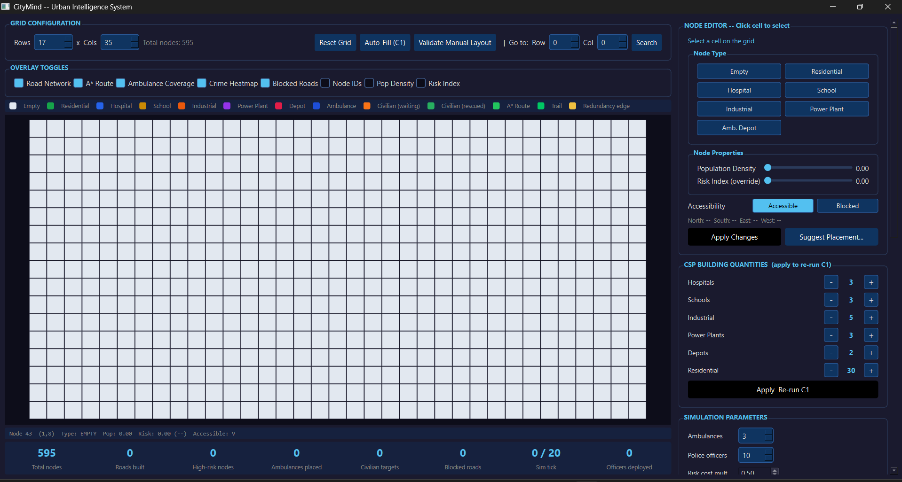
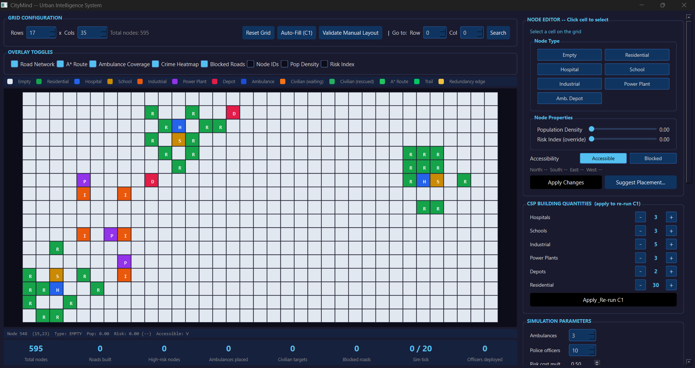
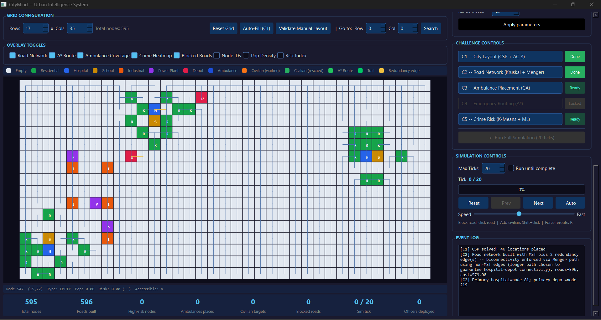
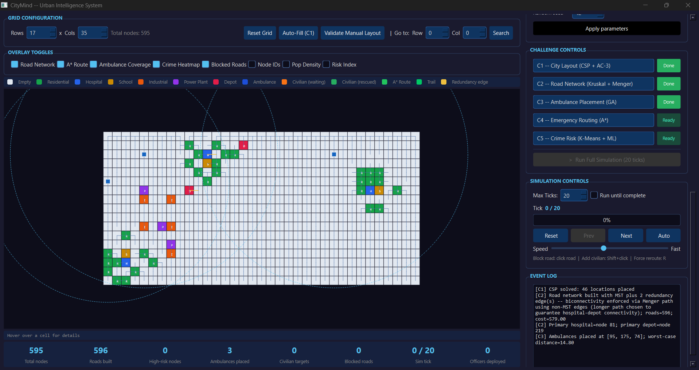
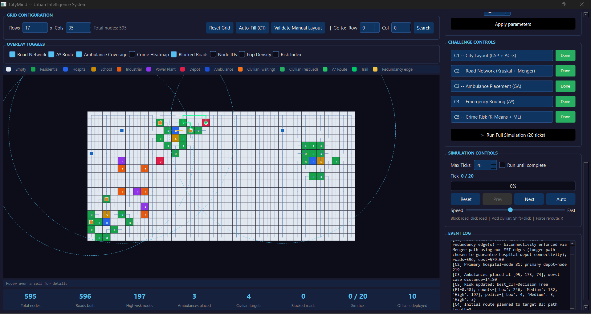
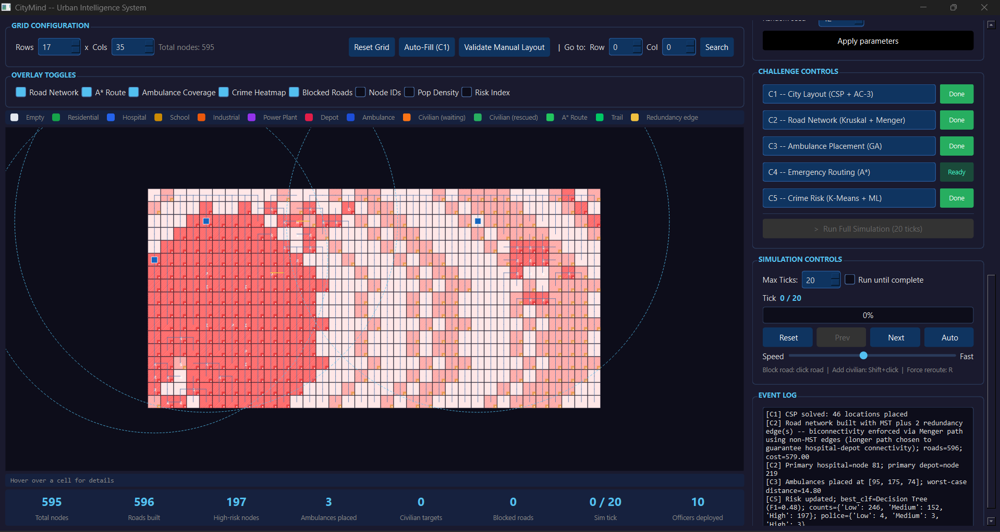

# CityMind – AI-Powered Smart City Simulator 🏙️

*Five AI algorithms. One city. Every decision backed by search, optimization, and machine learning.*

CityMind is an interactive smart city simulation built in Python with a PySide6 GUI. A 20×20 grid city is designed, connected, and managed entirely by a pipeline of five AI challenges — each one a different algorithm tackling a different real-world urban problem: constraint satisfaction for city layout, Kruskal's MST for road infrastructure, a genetic algorithm for ambulance deployment, A* search for emergency routing, and K-Means clustering with ML classifiers for crime risk analysis.

---

## 📸 Screenshots



*Application launched — empty grid with all five challenges locked*



*C1 complete — city laid out with hospitals, schools, industrial zones, power plants, depots, and residential areas placed via CSP*



*C2 complete — minimum-cost road network built using Kruskal's MST*



*C3 complete — ambulances optimally placed across the city using Genetic Algorithm, minimising worst-case response distance to residential nodes*



*C4 Full pipeline complete — ambulances deployed, emergency routing active, event log populated*



*C5 complete — crime risk heatmap overlay showing Low / Medium / High zones from K-Means clustering*

---

## 🏗️ Architecture Overview

CityMind runs as a single Python application with two modes:

- **GUI Mode** (`run_gui.py`) — A full PySide6 desktop interface with a live grid canvas, per-building configuration, challenge control panel with status badges, overlay toggles (risk heatmap, road highlights), a hover info bar, simulation tick controls, and a real-time event log
- **Console Mode** (`run_console.py`) — Runs the full challenge pipeline headlessly and prints results to terminal

The five AI challenges run in a locked pipeline — each one unlocks the next — and the simulation re-runs Challenges 3, 4, and 5 every tick as city state evolves.

---

## 🛠 Features

### 🧩 Five AI Challenges

**C1 — City Layout (CSP + AC-3)**
Places all city buildings — hospitals, schools, industrial zones, power plants, ambulance depots, and residential areas — on the grid using Constraint Satisfaction with AC-3 arc consistency. Enforces spatial constraints: power plants within 2 hops of all locations, residential areas within 3 hops, industrial zones buffered at least 3 cells from residential, depots within 8 hops of hospitals.

**C2 — Road Network (Kruskal's MST + Menger Connectivity)**
Builds the minimum-cost road network connecting all city nodes using Kruskal's algorithm with a Union-Find data structure. Selects the optimal primary hospital and depot using Dijkstra pre-computation, then verifies network connectivity using Menger's theorem.

**C3 — Ambulance Placement (Genetic Algorithm)**
Optimises placement of ambulances across the city using a Genetic Algorithm. Minimises worst-case distance from any ambulance to any residential node. Uses K-Means++ chromosome initialisation, tournament selection, crossover, and mutation over multiple generations.

**C4 — Emergency Routing (A\* Search)**
Routes ambulances to civilian targets using A* search with Manhattan distance heuristic. Handles multi-target dispatch with nearest-neighbour greedy leg planning, deferred unreachable targets, and full path cost tracking.

**C5 — Crime Risk Analysis (K-Means + ML Classifiers)**
Clusters city nodes into Low / Medium / High risk zones using K-Means++ with manual centroid initialisation. Trains and evaluates multiple classifiers (implemented from scratch: KNN, Decision Tree, Naive Bayes) via cross-validation, picks the best by F1 score, and allocates police officers proportionally to risk zones.

### 🖥️ GUI Features

- **Live grid canvas** — colour-coded city map with per-cell location type and risk overlay
- **Challenge control panel** — 5 challenge rows with Pending / Running / Done / Failed status badges; challenges lock/unlock in sequence
- **Building & simulation config** — sliders to set counts of each building type, ambulances, police officers, grid size, and simulation ticks before running
- **Node editor** — click any cell to inspect or manually reassign its location type
- **Overlay toolbar** — toggle risk heatmap and road highlights on the grid
- **Hover info bar** — hover over any cell to see node ID, type, risk level, and connectivity
- **Simulation controls** — run single ticks or full simulation; Challenges 3–5 re-execute each tick
- **Real-time event log** — timestamped log of every challenge result and simulation event

---

## 📁 Project Structure

```
CityMind/
│
├── algorithms/
│   ├── csp_layout.py           # C1 — City Layout CSP with AC-3
│   ├── road_network.py         # C2 — Kruskal MST + Menger connectivity
│   ├── ambulance_ga.py         # C3 — Genetic Algorithm for ambulance placement
│   ├── routing.py              # C4 — A* emergency routing
│   └── crime_risk.py           # C5 — K-Means clustering + ML classifiers
│
├── city/
│   ├── graph.py                # CityGraph — grid graph with Dijkstra, A*, road management
│   ├── node.py                 # CityNode dataclass
│   └── constants.py            # LocationType, RiskLevel enums and colour map
│
├── simulation/
│   ├── simulator.py            # CityMindSimulator — challenge pipeline + tick loop
│   └── event_log.py            # EventLog — timestamped simulation log
│
├── gui/
│   └── main_window.py          # CityMindGUI — full PySide6 interface
│
├── config.py                   # Default grid size, building counts, sim parameters
├── run_gui.py                  # Launch GUI mode
├── run_console.py              # Launch console mode
└── requirements.txt            # Python dependencies
```

---

## ⚙️ Prerequisites

- **Python 3.10+** — [Download here](https://www.python.org/downloads/)

---

## 🚀 Setup & Run

**Step 1 — Clone the repo and navigate to the source directory:**

```bash
git clone https://github.com/mughees-tariq/CityMind.git
cd CityMind
```

**Step 2 — Create a virtual environment and install dependencies:**

```bash
python -m venv venv
venv\Scripts\activate        # Windows
source venv/bin/activate     # macOS/Linux
pip install -r requirements.txt
```

**Step 3 — Run the app:**

```bash
# GUI mode (recommended)
python run_gui.py

# Console mode (headless pipeline)
python run_console.py
```

---

## 🤖 Algorithm Summary

| Challenge | Problem | Algorithm |
|---|---|---|
| C1 — City Layout | Place buildings respecting spatial constraints | CSP + AC-3 Arc Consistency |
| C2 — Road Network | Minimum-cost road infrastructure | Kruskal's MST + Union-Find + Menger's theorem |
| C3 — Ambulance Placement | Minimise worst-case response distance | Genetic Algorithm (K-Means++ init, tournament selection) |
| C4 — Emergency Routing | Route ambulances to civilian targets | A* Search (Manhattan heuristic, multi-target) |
| C5 — Crime Risk | Zone-based policing allocation | K-Means++ Clustering + KNN / Decision Tree / Naive Bayes |

---

## 📦 Tech Stack

| Layer | Technology |
|---|---|
| Language | Python 3.10+ |
| GUI | PySide6 (Qt for Python) |
| ML / Numerics | NumPy, scikit-learn |
| Algorithms | Custom implementations (no algorithm libraries used) |

---

## 👨‍💻 Developer

**Muhammad Mughees Tariq Khawaja** — [LinkedIn](https://linkedin.com/in/mugheestariq)

---

## 📜 Acknowledgments

Developed as a semester project for **CS 3051 - Artificial Intelligence** at FAST-NUCES, Spring 2026.
